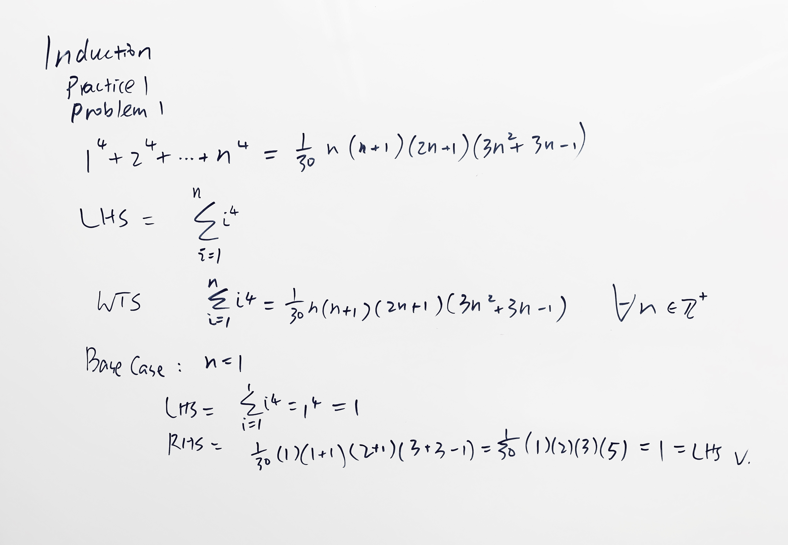

## Solution & Discussion - Induction Review Problems 1

- Relatively easy problems: 1, 2, 3, 5, 6, 9, 11
- Intermediate problems: 4, 10, 12
- Harder problems: 7, 8, 13, 14, 15

---

- For these problems complete solutions are given below: 1, 4, 5, 7, 9, 10
- These problems are similarly done as problems above: 2, 3, 6, 11, 12
- For the sole purpose of review these problems are NOT recommended: 8, 13, 14, 15

Following are solutions to problems 1, 4, 5, 7, 9, 10

### Problem 1

