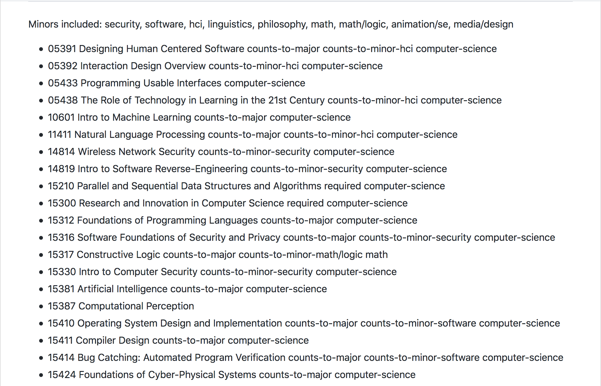
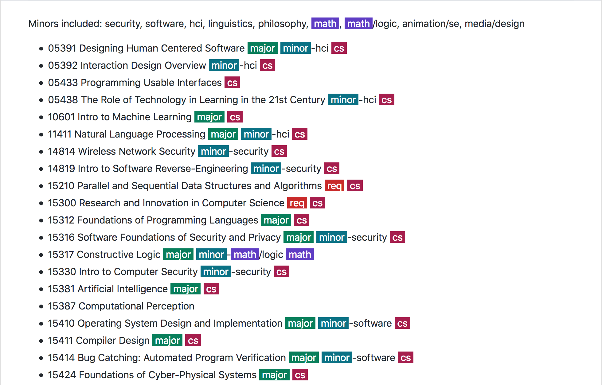
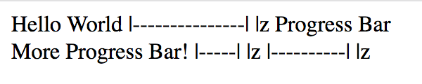
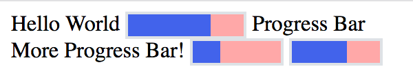

# My Lists

A collection of miscellaneous lists for my own reference.

- [Programming Languages to Learn](ProgLang.md)
- [Frameworks to Learn](Framework.md)
- [Favorite xkcd Comics](xkcd.md)
- [Hack Ideas](HackIdeas.md)
- [Technologies to Learn](Techs.md)
- [Courses to Consider](Courses.md)
- [Photo/Video Ideas](PhotoIdeas.md)
- [57173 Word List](57173-Words.md)
- [Personal Favorite Movies](FavMovies.md)
- [Random Rambling of Mathematics](MathIdeas.md)
- [15213 Midterm Review](213-Mid-Review.md)
- [EXCEL 151 Materials](https://github.com/SAMFYB/My-Lists/tree/master/EXCEL)
- [Color Palettes Collection](Palettes.md)

---

## Beautify the Markdown

Unfortunately, GitHub Markdown has many limitations. Despite basic text decorations like bold and italic, there is no way to colorize the text or change typography and font size arbitrarily. But, I'm glad to have found out the markdown documents are rendered as an HTML element with all the text as is. This means we can apply arbitrary JavaScript to change the styling of the text! The easiest way to achieve this is through browser extensions (in my case, Firefox add-on). So...

__BEFORE:__  __AFTER:__ 

And even fake progress bar! (just like GitHub Markdown fake check-boxes)

__BEFORE:__  __AFTER:__ 
